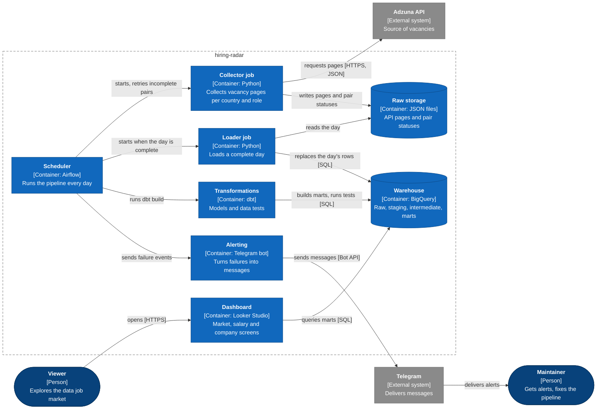
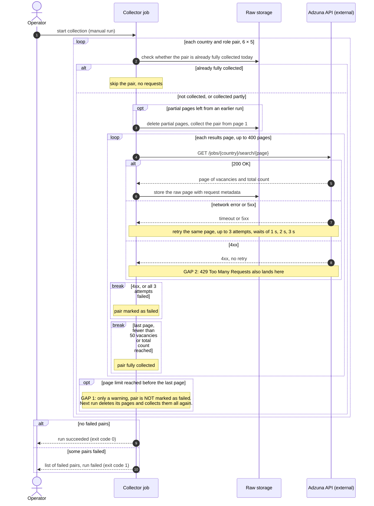
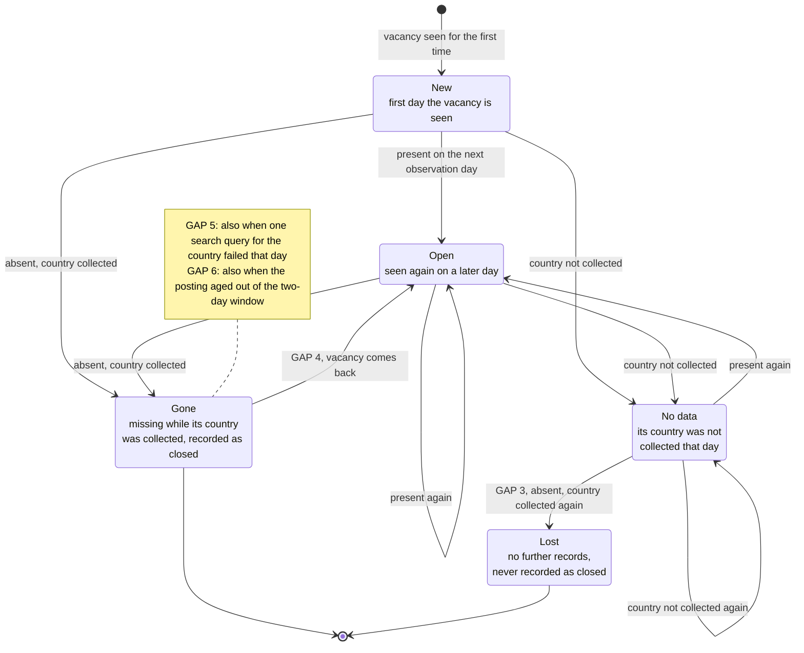
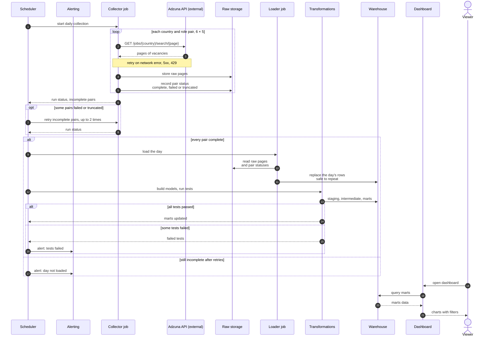

# NOTES

Журнал решений и находок по проекту `hiring-radar`. Пополняется по ходу работы.

---

## Источник: Adzuna API

### Лимиты

Тариф General access:

| Ограничение | Значение |
|---|---|
| Запросов в минуту | 300 |
| В сутки | 50 000 |
| В неделю | 150 000 |
| В месяц | 500 000 |


### Доступные страны

UK, ZA, AU, BR, CA, DE, NL, RU, PL, IN, FR, US.


---

## Разведка данных

Все цифры получены на выборках по 50 вакансий, запрос `data engineer`.

### Объём: запас открытых вакансий

| Страна | Всего найдено |
|---|---|
| us | 95 829 |
| gb | 7 809 |
| ca | 4 040 |
| de | 1 878 |
| pl | 1 415 |
| nl | 1 101 |

### Объём: поток новых за сутки (`max_days_old=1`)

| Страна | Новых в сутки |
|---|---|
| us | 1 717 |
| gb | 126 |
| ca | 97 |
| de | 73 |
| nl | 38 |
| pl | 20 |

**Вывод:** для проекта важен поток, а не запас — снимок снимается ежедневно. Нижняя граница разумности примерно 10–15 новых вакансий в сутки, иначе снимки будут почти одинаковыми и история не наберётся. По этому критерию проходят все страны.

**Следствие для пагинации:** US, GB, DE и CA не помещаются на одну страницу по 50 результатов. Нидерланды и Польша помещаются. Значит пагинация обязательна, иначе часть дневного потока теряется.

### Раскрытие зарплат

Доля вакансий с реальной зарплатой (`salary_is_predicted == "0"`):

| Страна | Из 50 | Доля |
|---|---|---|
| gb | 27 | ~54% |
| us | 2 | ~4% |

**Проверено отдельно:** флаг работает как в документации. При `salary_is_predicted == "0"` в вакансии присутствуют осмысленные `salary_min` и `salary_max` от работодателя (пример: 120 000 – 140 000). Гипотеза, что ноль означает «зарплаты нет вообще», не подтвердилась.

> **Уточнено на полном сборе 01.09, см. раздел ниже.** Вывод выше верен для gb и us, но неверен как общее правило: замер был сделан только на этих двух странах. В de, nl, pl флаг равен нулю у всех вакансий подряд, включая те, где зарплаты нет вовсе. Считать раскрытие по одному флагу нельзя.

**Причина различия:** в Британии указывать вилку в объявлении принято, в США в большинстве штатов не обязательно, в Германии зарплату обсуждают на собеседовании. Это наблюдение о рынке, не проверенный факт — но собственные замеры его подтверждают.

**Следствие:** зарплатные витрины строятся по странам с высоким раскрытием. Для остальных строятся витрины по объёму, ролям, компаниям и динамике. Появляется отдельная метрика, интересная сама по себе: доля вакансий, раскрывающих зарплату, в разрезе стран и во времени.

### Описания обрезаны

Поле `description` в ответе API обрезается до 500 символов (указано в документации, подтверждено многоточием в данных).

**Следствие:** извлечение навыков из полного текста невозможно. 500 символов — это примерно абзац, туда может попасть строка со стеком, но не гарантированно.

**Важное смещение:** частотность навыков, посчитанная по обрезанным описаниям, измеряет не «как часто просят Python», а «как часто Python упоминают в начале объявления». Это ограничение надо указывать при интерпретации любых выводов о навыках.

**Отвергнутая альтернатива:** дозагружать полный текст по полю `redirect_url`. Это парсинг чужих сайтов с разной вёрсткой плюс дополнительные запросы. Возможно на втором этапе, для первой версии избыточно.

### Схема ответа непостоянна

Поле `salary_min` отсутствует у части вакансий — не пустое, а отсутствует как ключ. Обращение через квадратные скобки падает с `KeyError`.

Проверяется по документации: поля со звёздочкой обязательные (`id`, `title`, `description`, `created`), остальные могут не прийти.

**Следствие:** обращаться через `.get()`, а не через `[]`. Сырьё сохранять как есть, без разбора на колонки — тогда отсутствующее поле не ломает загрузку, а решение о том, что делать с пропусками, принимается явно в staging.

### Пересечение выдач по ролям

Поиск идёт по вхождению слов в название и описание, а не по точному тайтлу. Замер по Великобритании:

| Запрос | Найдено |
|---|---|
| ml engineer | 1 058 |
| machine learning engineer | 894 |
| mlops engineer | 170 |

Эти множества пересекаются: вакансия с тайтлом «Machine Learning Engineer» попадает в оба первых запроса. Складывать числа нельзя.

**Следствие:** в сыром слое обязательно будут дубли одной вакансии, пришедшие из разных запросов. Дедупликация по `id` — обязательный шаг, а не опция. Без неё витрина покажет завышенные числа.

**Дополнительно:** запрос по роли и фактический тайтл вакансии — разные вещи. По запросу `data engineer` придут и «Senior Data Engineer», и «Data Engineering Manager», и посторонние вакансии. Нормализация тайтлов в отдельное измерение `dim_role` понадобится обязательно.

---

## Решения

### Что собираем

**Страны:** gb, de, nl, pl, us, ca

Первые четыре  — целевой рынок (европейская удалёнка). Канада тоже является целевым рынком, на котором имеется большое количество англоязычных вакансий. US добавлен ради объёма и контраста, зарплаты оттуда в расчёт не идут.

Остальные доступные страны (ZA, AU, BR, IN, FR) не добавлены сознательно: больше стран не делает проект лучше, инженерная часть одинакова для пяти и для двенадцати, а издержки на отладку и шум в витринах растут.

Россия проверена и отвергнута: Adzuna агрегатор западного происхождения, российский рынок закрыт на локальных площадках. Если понадобится русскоязычный сегмент, логичнее взять его нормальный источник — и это станет задачей второго этапа, где два источника надо будет свести в одну модель.

**Роли:** data engineer, analytics engineer, data analyst, data scientist, ml engineer

Роль — это измерение в модели, а не параметр скрипта. Поэтому собираются все пять, включая те, куда я не подаюсь прямо сейчас: без сравнения непонятно, много вакансий DE или мало.

`ml engineer` выбран вместо `machine learning engineer` — даёт больше результатов и, судя по пересечению выдач, покрывает большую часть второго. `mlops engineer` не добавлен: 170 вакансий, узкий срез, частично попадает в общую выдачу.

### Собираем всё, фильтруем в трансформациях

Параметр `salary_include_unknown` при сборе **не используется**.

Причина: если ставить его в ноль, вакансии без зарплаты выбрасываются навсегда. Это смещение — объявления с указанной зарплатой систематически отличаются от остальных по стране и типу компании. Аналитика описывала бы не рынок, а его часть.

Тот же принцип, что с сырым слоем: данные, выброшенные на входе, вернуть нельзя. Фильтровать нужно на выходе, в моделях.

### Окно свежести — 2 дня

`max_days_old=2`, не 1.

Причина: при окне в сутки пропуск одного запуска означает безвозвратную потерю данных за этот день. С окном в два дня пропуск компенсируется на следующем запуске, а появившиеся дубли убираются дедупликацией по `id`.

> **Пересмотрено 16.09, см. GAP 6 в разделе «Диаграммы поведения».** Для потока новых вакансий окно работает как задумано. Но из-за него склад не видит объявлений старше примерно трёх суток, и правило «пропала из выдачи = закрылась» при таком сборе не работает.

> **Заменено 23.09, см. «Решение по GAP 6: три режима сбора».** Единого окна больше
> нет: оно выбирается по паре функцией `window_for()` в `config.py`. Там, где весь
> запас помещается под потолок выдачи, окна нет вовсе.

### Разделение explore и extract

`explore.py` — блокнот для разведочных запросов, в пайплайн не входит.
`extract.py` — продовый сбор.

Причина возникла из практического неудобства: каждый эксперимент со статистикой требовал нового обращения к API. Разделив получение данных и их анализ, можно считать статистику сколько угодно раз по сохранённому файлу.

Это же и есть принцип, на котором стоит весь проект: сырьё сохраняется один раз и не трогается, всё остальное считается поверх него.

### Сохранение по файлам

Один файл на один запрос, с датой и параметрами в имени: `raw_2026-08-31_de_data-engineer_p1.json`.

Причина: единый `sample.json` перезаписывался при каждом запуске, из-за чего статистика считалась по данным одной страны, а интерпретировалась как данные другой. Один раз это уже привело к противоречивым цифрам.

---

### `count` меняется прямо во время обхода страниц

Замер на первом полном сборе `gb / data engineer`: на первой странице API сообщил `count` 507, на седьмой — 514. Между запросами в выдаче появились новые вакансии.

**Следствие:** снимок не атомарен, `count` — движущаяся величина, а не гарантия. Условие остановки не может опираться только на «набрали столько, сколько обещал `count`». Надёжный признак конца — неполная страница: пришло меньше `results_per_page`. Оба условия оставлены, но именно неполная страница закрывает обход корректно.

**Следствие для модели:** «сколько всего вакансий было в этот день» — величина, зависящая от момента замера. В витрине опираться нужно на фактически собранные уникальные `id`, а не на `count` из ответа. `count` сохраняется в `_meta` как справочная величина, не как источник истины.

### Квоты в заголовках ответа нет

Проверено на реальном ответе: в заголовках только `Date`, `Content-Type`, `Server`, `X-Catalyst` и CORS. Ни `X-RateLimit-*`, ни остатка квоты API не отдаёт.

**Следствие:** расход считать самим — по числу сохранённых файлов, один файл равен одному запросу. Открытый вопрос закрыт.

### Сеть рвётся, и это норма

На седьмой странице первого же полного обхода пришёл `ReadTimeout` при таймауте 30 секунд. Повтор с задержкой сработал, обход продолжился без потери страницы.

**Следствие:** повторы — не украшение, а обязательная часть. Логика: сетевые ошибки и 5xx повторяются с растущей паузой, 4xx не повторяется никогда, потому что это ошибка в самом запросе и вторая попытка вернёт то же самое.

### Формат хранения сырья: конверт с метаданными

Файл содержит не голый ответ API, а два блока: `_meta` и `payload`.

Причина: страна, роль и страница есть только в параметрах запроса, в самом ответе их нет. Если сохранить голый ответ, происхождение записи придётся восстанавливать разбором имени файла. Имя файла — не место для данных, от которых зависит загрузка: переименование или ручное копирование ломает пайплайн молча.

В `_meta` попадают также `count` из ответа, время загрузки в UTC и заголовки ответа. URL сохраняется с замаскированными ключами, иначе `app_key` уезжает в сырьё, а сырьё однажды окажется в облаке.

### Ключи вынесены в окружение

Были прописаны прямо в тексте `extract.py`. Теперь читаются из переменных окружения, при их отсутствии — из `.env`, который в `.gitignore`.

Причина не только в гигиене: ключ в коде попадает в историю git первым же коммитом, и удалить его оттуда потом сложнее, чем кажется — нужно переписывать историю.

### Ключ утёк в лог через текст исключения

Маскировка ключей стояла на URL, который скрипт формирует сам. Этого оказалось мало: при `MaxRetryError` библиотека `requests` вкладывает полный адрес запроса внутрь текста исключения, и `app_key` целиком напечатался в консоль вместе с ошибкой DNS.

**Исправление:** функция `mask()`, через которую проходит любой печатаемый текст — и текст исключения, и тело ответа при ошибке, и URL.

**Урок общий, не про этот проект:** секрет утекает не там, где его подставляют, а там, где что-то печатают. Маскировать надо на выходе, а не на входе. В Airflow логи задач хранятся, и такой ключ пролежал бы там до ротации.

### Повторный запуск дособирает, а не качает заново

За первый полный сбор из 25 пар страна-роль одна (`pl / data scientist`) не собралась совсем: на первой странице отвалился DNS, три попытки не помогли. Ещё одна (`us / data engineer`) обрезалась предохранителем на 3000 из 4020. Про обе было известно только по коду возврата 1.

**Исправление, две части.** Скрипт печатает список несобранных пар в конце, а не прячет их за кодом возврата. И перед сбором проверяет, что уже лежит на диске за сегодня: пара с неполной последней страницей считается готовой и пропускается.

**Отвергнутая альтернатива:** дописывать недостающие страницы к уже скачанным. Между запусками выдача сдвигается — появляются новые вакансии, старые уходят вниз. Склейка страницы 7 от одного момента со страницей 8 от другого даст и пропуски, и повторы, причём молча. Недособранная пара удаляется и собирается заново целиком.

**Следствие для Airflow:** это и есть идемпотентность задачи, которую всё равно пришлось бы делать для ретраев. Повтор упавшего запуска не портит уже собранное и не тратит запросы впустую.

### Предохранитель MAX_PAGES был занижен

Стоял 60 страниц, `us / data engineer` за окно в 2 дня дал 4020 вакансий — это 81 страница. Данные обрезались на 3000, и знать об этом можно было только из строки в логе.

Поднят до 150. Это по-прежнему предохранитель от бесконечного цикла, а не рабочий лимит: рабочий лимит — конец выдачи.

**Заодно цифра для планирования объёма:** один день сбора по всем 25 парам — порядка 12 000 записей и около 250 запросов. Квота в 50 000 запросов в сутки не жмёт даже близко.

> **Пересмотрено 17.09.** Первый прогон из Airflow: `us / data engineer` сообщил `count` 9 983 за то же окно в 2 дня, это 200 страниц. Пара упёрлась в 150 и получила статус truncated, день на склад не пошёл, как и задумано после GAP 1. Повторов id на страницах нет, выдача действительно выросла. Предел поднят до 400.

### Разведочный скрипт слит в explore.py

`check_first_answer.py` со второй копией ключей удалён, его функция `count_for` перенесена в `explore.py` с параметром `max_days_old`.

---

## Первый полный сбор, 01.09.2026

189 файлов, 8693 записи, 6584 уникальных `id`, 15 МБ на диске. Всё посчитано `analyze.py` по сохранённому сырью.

### Флаг `salary_is_predicted` сам по себе ничего не значит

| Страна | Всего | Флаг = 0 | Есть `salary_min` | И то, и другое | Раскрытие |
|---|---|---|---|---|---|
| de | 344 | 344 | 7 | 7 | 2.0% |
| gb | 1167 | 595 | 1167 | 595 | 51.0% |
| nl | 103 | 103 | 15 | 15 | 14.6% |
| pl | 71 | 71 | 4 | 4 | 5.6% |
| us | 7008 | 1296 | 7008 | 1296 | 18.5% |

Видно, что флаг и вилка ведут себя в разных странах противоположно. В gb и us `salary_min` есть **всегда** — там, где работодатель зарплату не указал, Adzuna подставляет собственный прогноз, и отличить одно от другого можно только флагом. В de, nl, pl наоборот: прогноз не считается вообще, флаг у всех записей равен нулю, а `salary_min` просто отсутствует у большинства.

**Следствие:** раскрытая зарплата — это конъюнкция двух условий, `salary_is_predicted == "0"` **и** `salary_min is not null`. По отдельности каждое из них даёт неверный ответ на одной из половин стран: только флаг даст 100% по Германии, только вилка даст 100% по США.

**Следствие для моделей:** признак `is_salary_disclosed` считается в staging по обоим полям сразу и дальше используется только он. Правило должно жить в одном месте, иначе каждая витрина посчитает раскрытие по-своему.

**Почему разведка этого не увидела:** замер делался на 50 вакансиях по gb и us — на двух странах, которые ведут себя одинаково. Уверенность в правиле была основана на выборке, где контрпример структурно не мог появиться.

**Заодно исправлена цифра по us:** на выборке в 50 вакансий получилось около 4%, на 7008 записях — 18.5%. Выборка в 50 штук для доли такого порядка слишком мала.

### Дедупликации по `id` недостаточно

Дубли между ролями нашлись, как и ожидалось: 8693 записи против 6584 уникальных `id`, 24.3%. Вакансии, найденные по двум запросам — 1206, по трём — 331, по четырём — 48.

Но обнаружилось второе, незапланированное измерение дублей. Среди уже уникальных по `id` записей 32.5% имеют повторяющуюся пару компания + тайтл:

```
163  us  Lumen — Lead Engineer - Public Sector
109  us  Oracle — Data Quality & Governance Analyst (Nashville, TN)
 70  us  GE Aerospace — Applied AI Engineer Intern - Summer 2027
 62  us  Syms Strategic Group — Angular/NodeJS Developer
```

Это одна и та же позиция, размноженная по городам: у каждой копии свой `id`, свои координаты, свой `redirect_url`. Дедупликация по `id` их не склеит, потому что для API это разные объявления.

**Следствие:** «сколько открыто вакансий» — величина, зависящая от того, что считать вакансией. Одна позиция Lumen даст 163 в витрине по объёму и 1 в витрине по спросу. Решать надо явно, в отдельной модели, а не молчаливо.

**Пока не решено, вынесено в открытые вопросы.** Склеивать по компании и тайтлу нельзя вслепую: у крупного работодателя может быть и правда десять одинаковых позиций в разных офисах. Скорее всего, в модели появятся обе меры — число объявлений и число позиций — а не одна вместо другой.

### Поиск ловит вакансии не по адресу

В топе тайтлов по частоте: «Angular/NodeJS Developer», «Audit & Assurance — Intern — Technology Controls Advisory», «Engineering Manager — Autonomy Evaluation». Это следствие того, что Adzuna ищет вхождение слов и в описании тоже: в тексте про аудит встречается «data», и вакансия попадает в выдачу по запросу `data analyst`.

**Следствие:** объём по стране и роли, посчитанный как есть, завышен неизвестно насколько, особенно по us. Нормализация ролей в `dim_role` — не задача причёсывания названий, а фильтр релевантности, без которого витрина по объёму врёт.

**Следствие для порядка работ:** правила `dim_role` надо строить и проверять до того, как появятся витрины, а не после.

---

## Блок 1: склад

Сырьё на диске не разбирается повторно руками. `load.py` переносит конверт в `raw.adzuna_results`: одна строка на вакансию в ответе, плюс `vacancy_json` как пришёл.

Локально склад — DuckDB. Те же модели dbt идут в BigQuery, когда появится проект. Проверять блок 1 можно без облака, по сбору 01.09.

**Роль.** Каноническое имя берётся из тайтла, не из `role_query`. Порядок: analytics engineer → ml engineer / mlops → data scientist → data engineer → data analyst. К аналитику также относятся data quality и data governance в тайтле. Нет совпадения → `other`, на витрины объёма не попадает. Европейские написания: dateningenieur, datenanalyst, data analist, datenwissenschaftler.

**Позиция.** `position_id` = компания + тайтл + страна. Объявления (`source_id`) и позиции считаются отдельно. Одна роль Lumen в 163 городах — 163 объявления и 1 позиция.

**Пропавшие.** На v1 id, которого не стало в выдаче страны, считается закрытым. Если по стране за день нет ни одной строки, gone не ставим: это дыра в сборе, не массовое закрытие.

> **Пересмотрено 16.09, см. GAP 6 в разделе «Диаграммы поведения».** Сбор идёт с окном свежести в 2 дня, поэтому вакансия выпадает из выдачи по возрасту. «Пропала» здесь не значит «закрылась».

**Зарплаты на витрине.** `show_salary` включён у gb и us. Канада выключена, пока не будет полного сбора и замера раскрытия.

Проверка после `dbt build`: `python report_marts.py`. Тайтлы в `mart_qa_unmatched_titles` — место, где смотреть, не срезал ли фильтр настоящие роли.

### Навыки: подтверждено, что мерить почти нечего

Хотя бы одна технология из списка встретилась в 13.4% обрезанных описаний. Лидеры: aws 5.0%, python 4.6%, sql 3.8%, azure 2.2%.

**Следствие:** измерение навыков по полю `description` из этого источника не строится — 13% покрытия описывают не рынок, а верстку объявлений. Либо второй источник с полным текстом, либо дозагрузка по `redirect_url`, либо признать, что навыков в модели не будет. Открытый вопрос закрыт с ответом «нет».

---

## C4 Container: сервис целиком

Из каких частей состоит сервис, чем каждая сделана и как они связаны. Нарисована в нотации C4 средствами Mermaid flowchart: встроенная C4-нотация Mermaid пока экспериментальная и плохо раскладывает блоки. Цвета по соглашению C4: тёмно-синий человек, синий контейнер, серый внешний сервис. Имена контейнеров те же, что на sequence-схемах.

**Это целевая схема, а не текущий код.** На самой схеме это не помечается; чего в репозитории пока нет, видно по таблице ниже.



**Что есть сейчас:**

| На схеме | Сейчас в репозитории |
|---|---|
| Viewer | дашборда пока нет |
| Maintainer | владелец проекта |
| Scheduler [Airflow] | нет, `extract.py`, `load.py` и `dbt build` запускаются вручную |
| Alerting [Telegram bot] | нет |
| Collector job [Python] | `extract.py`; статусов пар пока нет |
| Raw storage [JSON files] | `data/raw`, один JSON-файл на страницу |
| Loader job [Python] | `load.py`; проверки полноты дня пока нет |
| Transformations [dbt] | `dbt/`: staging, intermediate, marts и 26 тестов |
| Warehouse [BigQuery] | локально DuckDB `data/warehouse/hiring_radar.duckdb`; путь в BigQuery есть (`load.py --backend bigquery`, цель `prod` в `dbt/profiles.yml`), по README ещё не запускался |
| Dashboard [Looker Studio] | нет |
| Adzuna API | `BASE_URL` в `config.py` |
| Telegram | нет |

**Чего нет на схеме и почему:**

- Docker и VPS: где запущены контейнеры, показывает deployment-диаграмма, а не контейнерная;
- `explore.py`, `analyze.py`, `report_marts.py`: ручные инструменты, не часть работающего сервиса;
- DuckDB как локальный склад: схема описывает рабочий сервис, локальная разработка на ней не показывается.

---

## Диаграммы поведения

Нарисованы по коду на 16.09.2026, не по README. Всё, что помечено как GAP, подтверждено прогоном кода или замером на собранных данных, а не только чтением:

- `extract.py` запускался с подменённой сетью, ключами и папкой сырья: выдача без конца при `MAX_PAGES=3`, ответы 429, 503, 404;
- скомпилированный `int_vacancy_daily.sql` прогонялся в DuckDB в памяти на синтетике за три дня;
- возраст объявлений замерен по сбору 01.09 запросом к `raw.adzuna_results` в режиме только чтения (GAP 6).

Склад и `data/raw` при этом не трогались. Меняется код, меняется и диаграмма.

Участники, шаги и статусы названы по роли, а не по файлам и функциям. Под каждой схемой таблица «Где это в коде»: по ней любой элемент схемы находится в репозитории. Эти же имена используются на всех схемах проекта.

### Sequence: один прогон сбора

Граница схемы: один ручной запуск. Airflow и алерт в Telegram появятся снаружи, внутренняя часть от этого не изменится.



**Где это в коде.**

| На схеме | В коде |
|---|---|
| Operator | ручной запуск `python extract.py` |
| Collector job | `extract.py` |
| Raw storage | `data/raw`, один JSON-файл на страницу: `raw_<дата>_<страна>_<роль>_p<страница>.json` |
| Adzuna API (external) | `BASE_URL` в `config.py` |
| country and role pair, 6 × 5 | `COUNTRIES` × `ROLES` в `config.py` |
| check whether the pair is already fully collected today | `pair_is_complete()`, включается флагом `RESUME` |
| delete partial pages | `main()`, удаление файлов `stale` |
| each results page, up to 400 pages | цикл в `collect()`, предел `MAX_PAGES` |
| retry the same page, up to 3 attempts, waits of 1 s, 2 s, 3 s | `fetch_page()`: `RETRIES`, пауза `SLEEP_SEC * attempt * 4` |
| store the raw page with request metadata | `save()`, конверт `_meta` + `payload` |
| last page, fewer than 50 vacancies or total count reached | условие выхода в `collect()`: `len(results) < RESULTS_PER_PAGE` или `collected >= found` |
| pair marked as failed | список `failed` в `main()` |
| run succeeded / run failed | код возврата `main()`: 0 или 1 |

**GAP 1. Упор в MAX_PAGES выглядит как успешный сбор.**

Замер: выдача, которая никогда не кончается, `MAX_PAGES=3`. Скрипт сохранил 3 страницы, напечатал «упёрлись в предохранитель», не внёс пару в список несобранных и вернул код 0. Повторный запуск счёл пару недособранной, удалил три страницы и скачал их заново с тем же результатом.

**Следствие:** обрезанный сбор по коду возврата неотличим от полного. Airflow не поднимет тревогу, алерт не уйдёт, а каждый перезапуск заново потратит на эту пару все 150 запросов. Сейчас до предохранителя далеко (самая крупная пара, `us / data engineer`, около 81 страницы из 150), но при росте выдачи это случится молча.

**GAP 2. 429 не повторяется.**

Замер: на ответ 429 `fetch_page` делает одну попытку и возвращает `None`, как на 404. На 503 три попытки с паузами 1, 2 и 3 секунды.

**Следствие:** 429 означает «слишком часто, повтори позже», а скрипт трактует его как ошибку в самом запросе, и пара уходит в несобранные. Правило «4xx не повторять» из раздела «Сеть рвётся, и это норма» верно для 400 и 404, но не для 429. На практике не проявлялось: пауза 0.25 с держит темп ниже 240 запросов в минуту при лимите 300. Отдаёт ли Adzuna 429 при превышении, не проверено.

### State: статус объявления на дату наблюдения

Так, как его выводит `int_vacancy_daily.sql`. День наблюдения: `run_date`, за который на складе есть хоть одна строка. Пропущенный целиком запуск днём не считается, соседними становятся дни по обе стороны от него.



**Где это в коде.** Одним полем статус не хранится: он выводится из строк `fct_vacancy_daily`, которые строит `int_vacancy_daily.sql`.

| На схеме | В коде |
|---|---|
| vacancy | `source_id` |
| observation day | `observed_on` (это `run_date`), за который на складе есть хоть одна строка |
| country collected | за день по стране есть хоть одна строка: CTE `countries_on_date` |
| New | строка с `is_new = true` |
| Open | строка с `is_new = false` и `is_gone = false` |
| No data | строки нет, страны нет в `countries_on_date` за этот день |
| Gone | одна строка с `is_gone = true` в первый день отсутствия: CTE `gone` |
| Lost | после последней строки ничего, строки с `is_gone = true` нет |

**GAP 3. Закрытие теряется, если страна выпала из сбора.**

Замер: вакансия gb есть 01.09. За 02.09 по gb нет ни одной строки, de при этом собрана. 03.09 gb снова пришла, вакансии в ней нет. Строки gone нет ни за 02.09, ни за 03.09. Контроль: вакансия de, пропавшая 02.09 при собранной de, получает gone за 02.09, как задумано.

**Причина:** пропажа ищется только между соседними днями наблюдения. 03.09 сравнивается с 02.09, а за 02.09 по gb строк нет, и вакансии среди них тоже нет.

**Следствие:** правило «страна не пришла, gone не ставим» из блока 1 защищает от ложных закрытий, но заодно теряет настоящие закрытия за этот промежуток. Такой вакансии нет ни среди закрытых, ни среди открытых после 01.09, она просто пропадает из данных. `n_gone` занижен.

**GAP 4. Вернувшаяся вакансия уже успела закрыться.**

Замер: вакансия de есть 01.09, пропала 02.09 (строка gone), вернулась 03.09. За 03.09 строка с `is_new = false`, `is_gone = false`, `days_open = 3`: день отсутствия посчитан как открытый. Строка gone за 02.09 остаётся.

**Следствие:** `n_gone` за 02.09 включает вакансию, которая не закрывалась. Если Adzuna временно не отдаёт объявление (сдвиг выдачи при глубокой пагинации, см. открытые вопросы), закрытия будут завышены. Нужно решить, что считать закрытием: одно отсутствие или несколько подряд.

GAP 3 и GAP 4 сдвигают `n_gone` в разные стороны и в итоговой цифре могут частично гасить друг друга, поэтому по одной витрине их не заметить.

**GAP 5. Сбой одной пары даёт ложные закрытия.**

Защита «страна не пришла, gone не ставим» работает на уровне страны, а сбор идёт по парам страна-роль. Если одна пара не собралась, а остальные пары этой страны собрались, страна считается собранной. Вакансии, которые пришли бы только по упавшему запросу, получают gone, назавтра возвращаются, и дальше работает GAP 4.

Пример: при первом полном сборе у `pl / data scientist` на первой странице отвалился DNS, остальные пары по Польше собрались (см. «Повторный запуск дособирает, а не качает заново»). Будь 01.09 не первым днём истории и загрузи мы его на склад до дособирания, все вакансии, найденные только по запросу data scientist, закрылись бы на один день.

Отдельного прогона не было: в условии gone роль запроса не участвует, модель смотрит только на страну (CTE `gone` в `int_vacancy_daily.sql`). Сценарий совпадает с контрольным случаем из GAP 3: вакансии нет, страна собрана, gone ставится.

**Следствие:** любая ошибка на одной паре, включая GAP 2, превращается в ложные закрытия, если день загрузили, не дособрав. Узнать об этом модель не может: неудачная пара не оставляет в `raw.adzuna_results` никакой записи, только отсутствие строк.

**GAP 6. При окне свежести в 2 дня пропажа из выдачи не означает закрытие.**

Главный из найденных пробелов. GAP 3 и GAP 4 уточняют правило, которое в текущем виде измеряет не то.

Сбор идёт с `max_days_old=2`, и API отдаёт только недавно созданные объявления. Вакансия, опубликованная 01.09 и открытая месяц, выпадет из выдачи через двое-трое суток просто по возрасту. Модель запишет ей gone, а `days_open` ни у кого не превысит трёх дней.

Замер по сбору 01.09. Возраст: `extracted_at` минус `posted_at` (поле `created` из ответа).

| Страна | Записей | Самый старый, ч | Старше 48 ч | Старше 72 ч |
|---|---|---|---|---|
| de | 344 | 71.6 | 64 | 0 |
| gb | 1167 | 70.0 | 843 | 0 |
| nl | 103 | 46.3 | 0 | 0 |
| pl | 71 | 48.5 | 1 | 0 |
| us | 7008 | 56.4 | 1598 | 0 |

Ни одной записи старше трёх суток. Для сравнения: без фильтра по одному запросу `data engineer` API находит в us 95 829 вакансий (раздел «Объём: запас открытых вакансий»), а сбор с окном принёс по us 7 008 записей на все пять ролей вместе. Склад копит поток новых объявлений, а не запас открытых.

**Оговорка:** вывод верен, если Adzuna не обновляет `created` у висящих вакансий. По одному дню это не проверить. Способа два: второй полный сбор и сравнение `id` и `created` за два дня (вернулся ли id с новой датой) или один запрос без `max_days_old` по небольшой паре, например `nl / data engineer` (около 1 100 вакансий, 23 страницы): есть ли в выдаче объявления старше недели.

**Попутно:** `created` приходит с пометкой `Z`, но у 26 записей de, 14 nl, 3 gb и 1 pl он позже момента сбора, максимум на 1.9 ч. Похоже на местное время под видом UTC. Возраст европейских записей в таблице поэтому занижен на 1-2 ч, у us таких записей нет. На вывод «не старше примерно трёх суток» это не влияет.

**Следствие:**

- экран 4 дашборда (медиана дней, которые позиция висит; кто держит роли открытыми дольше всех) и счётчики «пропало» на экранах 1 и 2 при текущем сборе показывают возраст объявления, а не жизнь вакансии;
- решение блока 1 «пропавшая считается закрытой» и закрытый вопрос о пропавшей вакансии открываются заново;
- GAP 3 и GAP 4 не чинить до решения по GAP 6, иначе уточняется правило, которое всё равно придётся переписать.

Варианты, решение не принято:

- собирать полный запас, а не поток. Минус: по `us / data engineer` около 95 тысяч вакансий, это около 1 900 страниц на одну пару, сразу GAP 1. Глубину пагинации Adzuna не проверяли;
- полный запас только по небольшим странам, поток по остальным;
- убрать время жизни и закрытия из v1, оставить поток новых, раскрытие зарплат и компании.

**GAP 7. Adzuna обрезает выдачу на сотой странице, и обрезку не видно.**

Найдено 23.09 при проверке глубины пагинации для GAP 6. Страницы 100, 101, 102, 500
и 2000 по `us / data engineer` возвращают **одно и то же содержимое**: все 50 id
совпадают. Страницы 98 и 99 при этом нормальные. То есть глубже 5 000 вакансий
(100 страниц по 50) API не пускает, но вместо ошибки или пустой страницы молча
повторяет сотую. Код ответа 200.

Проверка полноты в `collect()` сравнивала **число строк** с `count` из ответа, и
повторы исправно набивали этот счётчик. Пара доходила до `count` и помечалась
complete, будучи обрезанной вдвое.

Что из этого вышло на собранных днях по `us / data engineer`:

| День | Файлов | Строк | Разных вакансий | Статус в журнале |
|---|---|---|---|---|
| 17.09 | 182 | 9 100 | 4 974 | complete |
| 19.09 | 183 | 9 150 | 4 999 | complete |

Ровно 5 000 не получается, потому что за час сбора выдача сдвигается: приходят
новые объявления, часть старых переезжает на страницу вперёд.

В витринах это не видно вообще: дедупликация по `id` убирает повторы, данные
выглядят чистыми, просто вакансий меньше, чем на рынке. Тихий рапорт об успехе —
худший вид ошибки, и поймали его случайно.

**Исправлено:** `collect()` и `complete_by_files()` считают разные `id`, а не строки.
Страница, не принесшая ни одной новой вакансии, означает, что выдача пошла по кругу:
сбор останавливается и пара помечается truncated. На первой странице выводится
предупреждение, если `count` подобрался к 90% потолка.

**Отвергнуто:** резать американскую выдачу по типу занятости, чтобы сохранить окно
в 2 дня. Замер 23.09 по `us / data engineer`: всего за 2 дня 5 247, из них full_time
1 257, part_time 104, permanent 170, contract 292. Сумма 1 823 — у большинства
объявлений тип занятости не заполнен, и они потерялись бы между кусками.

### Решение по GAP 6: три режима сбора

Принято 23.09, после замера запаса по всем парам и проверки глубины.

Срок жизни объявления считается только там, где весь запас помещается под потолок:
тогда пропажа из выдачи означает, что объявление сняли, а не что ему исполнилось
трое суток.

| Пары | Режим | Что даёт |
|---|---|---|
| nl, pl, de, ca — все роли; gb — analytics engineer, data analyst, ml engineer | без окна, весь запас | поток и срок жизни |
| gb — data engineer, data scientist; us — все роли кроме data engineer | окно 2 дня | только поток |
| us — data engineer | окно 1 день | только поток |

Запас по парам, замер 22.09: nl 2 180, pl 2 211, de 4 387, ca 11 582, gb 17 950,
us 205 561. Под потолок не лезут `gb / data engineer` (7 960), `gb / data scientist`
(5 384) и все пары us. У `ca / data engineer` 4 829 из 5 000 — эта пара ближе всех
к потолку, и однажды его перешагнёт; поймает это проверка на повтор страницы.

Окно 1 день для `us / data engineer` нужно потому, что за 2 дня там 5 247 (23.09) и
9 145 (19.09) — потолок не вмещает. Цена решения: пропущенный запуск эта пара теряет
безвозвратно, страховки в виде второго дня у неё больше нет.

**Следствие для витрин, ещё не сделано:** правило «пропала из выдачи = закрылась»
имеет смысл только для пар, собираемых без окна. Для остальных счётчики закрытий
и экран 4 либо не строятся, либо помечаются как неприменимые. Метрику честно
называть «сколько держится объявление», а не «сколько открыта вакансия»: пропажа
из Adzuna означает снятое объявление, а не обязательно закрытую позицию.

**Проверка, которую надо сделать через неделю переписи:** возраст снятых объявлений.
Если он размазан от дней до месяцев — метрика живая. Если снова упирается в стену
на трёх сутках, значит, где-то остался искусственный обрез.

### Sequence: один день данных, весь сервис

**Это целевая схема, а не текущий код.** Она показывает, как сервис работает после исправления пробелов и появления планировщика, алертов и дашборда. На самой схеме это не помечается, как и на любой схеме проектирования: чего в репозитории пока нет, видно по таблице ниже. Текущее поведение сбора описано схемой выше.

Участники названы так же, как на остальных схемах. Детали сбора (страницы, паузы, условия выхода) свёрнуты в один шаг: они на детальной схеме сбора.



**Какие пробелы закрывает (для журнала, на схеме не отмечается):**

| GAP | Как закрыт в целевой схеме |
|---|---|
| 1 | Упор в предел страниц даёт паре статус truncated, прогон считается неполным |
| 2 | 429 повторяется с паузой, как сетевые ошибки и 5xx |
| 3, 5 | Неполный день не загружается на склад. Каждый загруженный день полный по всем парам, поэтому ни выпавшая страна, ни упавшая пара не дают потерянных или ложных закрытий |
| 4, 6 | Не закрыты. Правило закрытия ждёт замера по GAP 6 |

**Решение по GAP 3 и GAP 5 (предложение, не утверждено):** день грузится на склад, только если все пары собраны полностью. Один пропущенный день безопасен: окно свежести в 2 дня подберёт его новые объявления на следующем сборе, а для модели пропущенный запуск просто не день наблюдения.

**Цена:** одна упавшая пара блокирует весь день, на графиках динамики будет дыра. Поэтому неполные пары сначала повторяются, и только если не помогло, приходит алерт.

**Отвергнутая альтернатива:** грузить неполный день и не считать закрытия по странам, где есть упавшие пары. Данных больше, но правило живёт в SQL и ломается незаметно: GAP 3 и GAP 5 появились ровно так.

**Что есть сейчас и что нужно для целевой схемы:**

| На схеме | Сейчас в репозитории | Что нужно |
|---|---|---|
| Scheduler (planned) | нет, команды запускаются вручную | Airflow: сбор, загрузка и `dbt build` по расписанию, повтор неполных пар |
| Alerting (planned) | нет | сообщения в Telegram из планировщика |
| Collector job | `extract.py` | статус каждой пары за день: complete, failed, truncated (GAP 1); 429 в ветку повторов (GAP 2) |
| Adzuna API (external) | `BASE_URL` в `config.py` | без изменений |
| Raw storage | `data/raw`, один JSON-файл на страницу | плюс файл статусов пар за день |
| Loader job | `load.py`, замена дня через delete + insert по `run_date` | проверка статусов, неполный день не грузится (GAP 3, GAP 5) |
| Transformations | dbt: staging, intermediate, marts и 26 тестов, `dbt build` | правило закрытия после замера (GAP 4, GAP 6) |
| Warehouse | DuckDB `data/warehouse/hiring_radar.duckdb`; BigQuery через `load.py --backend bigquery` и цель `prod` в `dbt/profiles.yml`, по README ещё не запускался | без изменений |
| Dashboard (planned) | нет | Looker Studio над витринами |
| Viewer | человек, который открывает дашборд | без изменений |

**Что не попало на схему и почему:**

- `explore.py` и `analyze.py`: ручные инструменты разведки, в ежедневный прогон не входят;
- `report_marts.py`: ручная сводка по витринам после dbt, в автоматический прогон не входит;
- Docker и VPS: это не участники обмена, а место, где всё запущено. Их место на deployment-диаграмме;
- `.env` и ключи: настройка, а не шаг прогона;
- страницы, паузы и условия выхода сбора: на детальной схеме сбора выше.

---

## Инциденты

### JSONDecodeError вместо внятной ошибки

Скрипт падал с `json.decoder.JSONDecodeError: Expecting value: line 1 column 1` при попытке разобрать ответ.

Причина: API вернул код 400 и HTML-страницу с ошибкой вместо JSON. Метод `.json()` вызывался без проверки статуса.

Первопричина 400: в параметры запроса передавалось поле `salary_is_predicted`, которое является **полем ответа**, а не параметром запроса. Путаница возникла из-за того, что описания параметров и модели ответа находятся в разных разделах документации.

**Исправление:** проверять `status_code` до вызова `.json()`, при ошибке печатать код и начало тела ответа.

**Урок:** в пайплайне неинформативное падение хуже, чем обработанная ошибка. Скрипт должен говорить «API вернул 400, вот текст», а не выдавать десять строк трассировки про разбор JSON.

### KeyError на отсутствующем поле

`KeyError: 'salary_min'` при обходе немецких вакансий.

Причина: поле необязательное и отсутствует у части записей. В британской выборке оно было почти везде, поэтому проблема не проявлялась.

**Исправление:** `.get()` вместо `[]`.

**Урок:** схема источника непостоянна между странами. Это первый случай, когда данные оказались не такими, как ожидалось, и он подтверждает решение хранить сырьё без разбора на колонки.

---

## Открытые вопросы

Всё, что считается по сохранённому сырью, живёт в `analyze.py` и пересчитывается одной командой, без обращения к API. Результаты вносить сюда после каждого прогона.

Закрыто полным сбором 01.09:

- ~~Доля вакансий с реальной зарплатой по de, nl, pl~~ — 2.0%, 14.6%, 5.6%, и правило подсчёта оказалось другим
- ~~`count` по всем пяти ролям~~ — посчитан, таблица выше
- ~~Остаток квоты в заголовках ответа~~ — API его не отдаёт
- ~~Доля описаний с названиями технологий~~ — 13.4%, измерения навыков из этого источника не будет

Закрыто в блоке 1 (склад):

- ~~Позиция или объявление~~ — обе меры. Объявление = `source_id`. Позиция = компания + тайтл + страна (`position_id`). Витрины показывают обе цифры.
- ~~Правила `dim_role`~~ — фильтр по тайтлу, не по `role_query`. Канонические пять ролей плюс `other`. `other` на витрины объёма не попадает. Проверка: `mart_qa_unmatched_titles`.
- ~~Пропавшая вакансия~~ — на v1 считается закрытой: строка факта с `is_gone` в день, когда id пропал из выдачи этой страны. Если страна за день не пришла совсем, gone по ней не считаем — это сбой сбора. **Открыт заново 16.09, см. GAP 6.**

Открыто:

- Проверить, стабилен ли `id` вакансии между днями. Если Adzuna переиздаёт объявление под новым `id`, дедупликация по `id` не поймает повтор и время жизни посчитается неверно
- Проверить, есть ли смещение в порядке выдачи при глубокой пагинации: `us / data engineer` — это 82 запроса, между первым и последним проходит несколько минут, и выдача за это время сдвигается
- Доля раскрытия по Канаде — в первом сборе страны не было, цифру берём со следующего полного прогона. До этого `show_salary` у ca выключен.

Найдено по диаграммам поведения, подробности и замеры в том разделе:

- GAP 1. Что делать при упоре в `MAX_PAGES`: ненулевой код возврата, отдельная пометка «обрезано» в итоге, качать ли такую пару заново при перезапуске
- GAP 2. Повторять ли 429 с паузой, как 5xx. Проверить, отдаёт ли его Adzuna при превышении лимита
- GAP 3. Как ставить gone, если между последним присутствием и отсутствием страна выпадала из сбора. Ждёт решения по GAP 6
- GAP 4. Что считать закрытием: одно отсутствие или несколько подряд. Как считать `days_open` у вернувшейся вакансии. Ждёт решения по GAP 6
- GAP 5. Как отличить «пара не собралась» от «вакансия пропала»: неудачная пара сейчас не оставляет следа на складе
- GAP 6. Как определять закрытие при окне свежести в 2 дня. Сначала замер: обновляет ли Adzuna `created` у висящих вакансий. Потом выбор: полный запас, запас только по небольшим странам или v1 без времени жизни
- `created` помечен как UTC, но у части европейских записей он позже момента сбора, до 1.9 ч. Проверить, не местное ли это время
- Целевая схема: утвердить правило «неполный день не грузится на склад» (GAP 3, GAP 5) и цену решения, дыры в динамике
