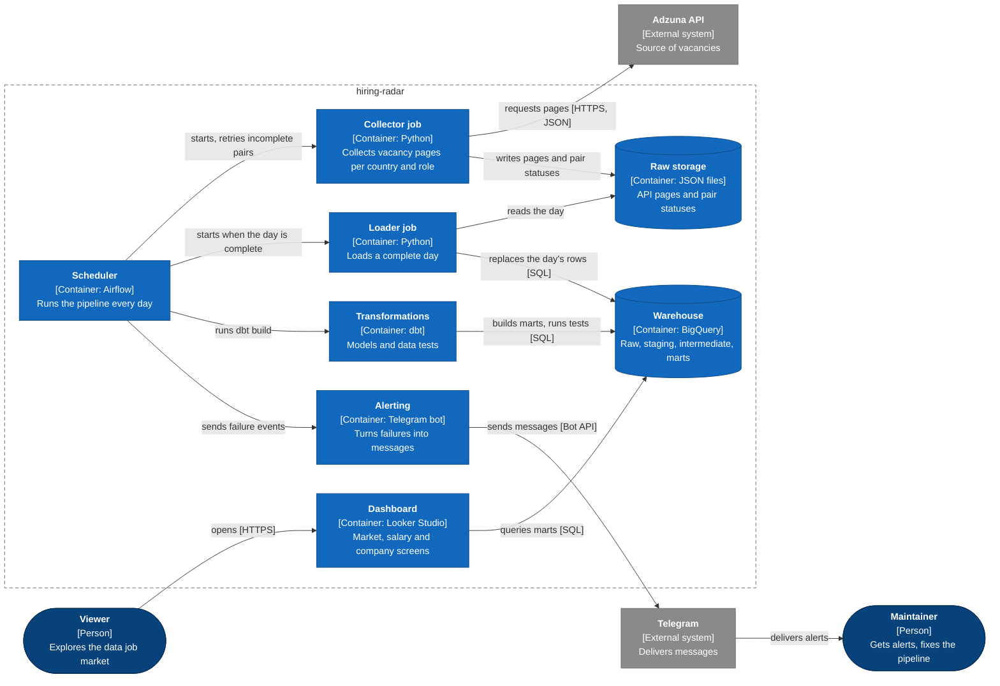
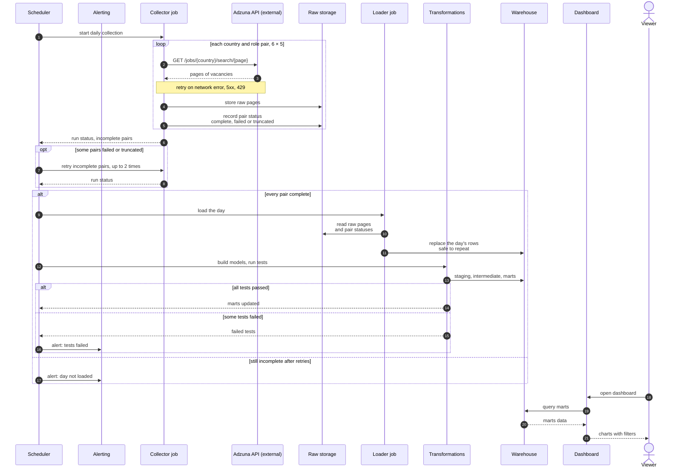

# hiring-radar

[](https://github.com/alinatkachenko13/hiring-radar/actions/workflows/ci.yml)

A daily pipeline that collects data job vacancies (6 countries, 5 roles), keeps their history in a warehouse and shows how the market changes day to day. Job boards show today's snapshot; the value here is the accumulated history.

## Architecture



## One day of data



## Key decisions

- **Raw data is kept as received.** Every API page is stored with its request metadata; everything downstream is rebuilt from it.
- **A day is loaded only when every country and role pair is fully collected.** A missing country or a failed query can never look like closed vacancies.
- **Two volume measures.** Ads are unique ids; positions are company + title + country. On the first full run, 32.5% of unique ads repeated one position across cities.
- **Salary counts as disclosed only when two fields agree.** The provider's flag alone was wrong for 3 of 5 countries, the salary field alone for the other 2.
- **Role comes from the title, not the search query.** Search matches descriptions too, so irrelevant titles are filtered out before any volume is counted.
- **Two collection modes.** Where the whole stock fits under the API's 5 000-result ceiling, it is collected without a freshness window: only then does a vacancy leaving the feed mean it was taken down rather than aged out. The rest is collected as a flow and carries no lifetime metric.
- **Skills are not modelled.** Descriptions are cut to 500 characters and name a technology in only 13.4% of them.


## Data model

| Model | Content |
|---|---|
| `fct_vacancy_daily` | one ad per observation day: salary, disclosure, new or gone, listing lifetime where it is measurable |
| `dim_vacancy` | ad attributes with change history (SCD Type 2) |
| `dim_company`, `dim_country`, `dim_location`, `dim_role`, `dim_date` | lookups; `dim_role` also filters irrelevant titles |
| `mart_market_daily`, `mart_salary_daily`, `mart_salary_disclosure`, `mart_company_role`, `mart_city_daily` | aggregated market, salary, company and city views |
| `looker_vacancies` | one flat table the Looker Studio dashboard reads |

## Stack

Python, dbt, BigQuery (DuckDB locally), Airflow, Docker Compose, Looker Studio, Telegram Bot API.

## Run locally

```bash
python3 -m venv .venv && source .venv/bin/activate
pip install -r requirements.txt
cp .env.example .env    # add ADZUNA_APP_ID and ADZUNA_APP_KEY
python extract.py       # collect raw pages into data/raw
python load.py          # load them into data/warehouse/hiring_radar.duckdb
cd dbt && dbt build --profiles-dir . && cd ..
python report_marts.py  # summary of the marts
```

BigQuery: fill the GCP values in `.env` (see `.env.example`), keep the service account key in `gcp-service-account.json` (ignored by git), then run `python load.py --backend bigquery` and `./bq_build.sh`.

Scheduler: add `TELEGRAM_BOT_TOKEN` and `TELEGRAM_CHAT_ID` to `.env`, run `docker compose up -d --build` and open Airflow at http://localhost:8080 (on a shared server the port is set by `AIRFLOW_PORT`, see [docs/deploy.md](docs/deploy.md)). The DAG `hiring_radar_daily` collects, loads the complete day and runs `dbt build` every day at 06:00 UTC.

## Status

| Part | State |
|---|---|
| Collection with per-pair statuses, loading of complete days, dbt models and 26 tests | working |
| CI on GitHub Actions: every push loads two fixture days into DuckDB and runs `dbt build` with all tests | working, see [.github/workflows/ci.yml](.github/workflows/ci.yml) |
| BigQuery warehouse and Looker Studio dashboard with 4 screens | working, see [looker/README.md](looker/README.md) |
| Airflow DAG with retries and Telegram alerts, Docker Compose | built, see [airflow/dags](airflow/dags) and [docker-compose.yml](docker-compose.yml) |
| Deployment on a VPS | deployed, the daily run happens on the server, see [docs/deploy.md](docs/deploy.md) |
| Vacancy closure rule | reworked: a removal counts only where the whole stock is collected, see NOTES.md |
| Lifetime metric on real data | waiting for three census days in a row, first removals expected 26.09 |

