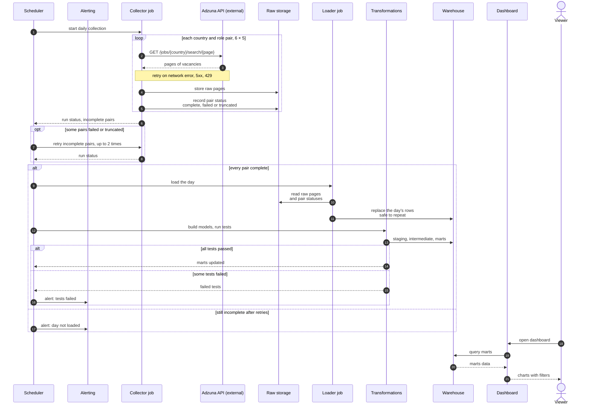

# hiring-radar

Ежедневный сбор вакансий в дата-профессиях, склад с историей и дашборд, на котором видно, как рынок меняется день ото дня.

**Ключевая идея:** все job-борды показывают текущий срез. Ценность здесь в накопленной истории — из неё берутся динамика спроса, время жизни вакансии, изменения зарплат и всё остальное, чего у бордов нет.

---

## Результат v1

Готовый продукт первой поставки — **публичный дашборд** над витринами в BigQuery. Пайплайн нужен затем, чтобы дашборд обновлялся сам и ему можно было верить.

**Для кого.** Для себя — понять, куда смотреть на рынке (Европа сейчас, Канада как рынок на будущее). Для портфолио — показать продакшен-цепочку: сырьё → склад → тесты → витрины → то, что можно открыть по ссылке.

**Страны:** gb, de, nl, pl, us, ca.
**Роли:** data engineer, analytics engineer, data analyst, data scientist, ml engineer.

На дашборде общие фильтры: страна, роль, тип контракта, дата или окно дат.

### Экраны

**1. Обзор рынка.** Снимок «как сейчас» и куда движется.

- Сколько уникальных объявлений и сколько позиций сегодня (это разные числа: одна роль, размноженная по городам, даёт десятки `id`)
- Сколько новых с прошлого сбора, сколько пропало
- Доля вакансий с раскрытой зарплатой
- Состав: permanent / contract, full-time / part-time, грейд из тайтла (junior / mid / senior / lead)
- Доля remote/hybrid — эвристика по тайтлу и обрезанному описанию, на графике подписана как оценка, не как поле API

**2. Спрос и динамика.** То, чего нет ни на одном борде.

- Две кривые: объявления и позиции, страна × роль
- Поток: появилась / ещё открыта / пропала
- Города внутри страны — для ca и gb это рабочий разрез (Toronto / Vancouver, London / остальная Британия), не карта всех точек US

**3. Зарплаты.** Только там, где вилку реально указывает работодатель.

- Медиана и квартили по роли, динамика медианы
- Сравнение страны и роли с оговоркой по валюте: gb и us не складываются в одну цифру
- Доля раскрытия по странам во времени — отдельный график, не подпись мелким шрифтом

Правило раскрытия одно: `salary_is_predicted == "0"` **и** непустой `salary_min`. Зарплатные графики — по gb и us. Канада идёт в те же графики, только если после полных сборов раскрытие окажется достаточным; иначе для ca, de, nl, pl остаются объём и динамика. Цифры US — контраст рынка, не ориентир для отклика.

**4. Компании и время жизни.** Практический экран для поиска работы.

- Кто нанимает сейчас: топ компаний по позициям, не по объявлениям
- Кто добавил больше всего вакансий за неделю
- Медиана дней, которые позиция уже висит; кто держит роли открытыми дольше всех
- Таблица «компания × роль»: сколько открыто, сколько новых, медиана вилки если она раскрыта

**Не выносим на дашборд.** Навыки из описания: API обрезает текст до 500 символов, покрытие технологий ~13% — это не рынок, а верстка объявлений. Рекомендации и телеграм-бот с рассылкой — после v1.

---

## Статус

В разработке. Сейчас: блок 1, склад. Канады в первом сборе 01.09 ещё нет — она появится со следующего полного прогона `extract.py`.

v1 считается готовым, когда дашборд открывается по ссылке, в фильтрах есть Канада, данные копятся ежедневно и пайплайн сам поднимается после сбоя.

### Три блока

**Блок 1. Склад.** Сырьё с диска → таблица raw → dbt (staging, роли, факты, витрины, тесты). Проверяется локально по уже собранным файлам.

- [x] Разведка источника, замеры качества данных
- [x] Одиночный запрос к API, сохранение сырья
- [x] Сбор по всем комбинациям стран и ролей с пагинацией
- [x] Загрузка сырья на склад (`load.py`, локально DuckDB; BigQuery тем же скриптом)
- [x] dbt: staging, intermediate, marts и тесты

**Блок 2. Дашборд.** Looker Studio над витринами: четыре экрана и общие фильтры, включая Канаду.

- [ ] Дашборд над витринами

**Блок 3. Прод.** Расписание, ретраи, бэкфилл, алерты, машина.

- [ ] Airflow: расписание, ретраи, бэкфилл
- [ ] Тесты качества и алертинг в Telegram
- [ ] Деплой на VPS

---

## Архитектура

```
Adzuna API
    │
    ▼
extract.py ──► RAW на диске: JSON как пришёл + метаданные загрузки
                    │
                    ▼
              load.py ──► raw.adzuna_results (DuckDB локально, BigQuery в проде)
                    │
                    ▼
              dbt staging ──► intermediate ──► marts
              (свои имена     (роли, грейды,   (звезда:
               полей, типы)    remote, позиция  факты + измерения)
                               vs объявление)
                    │                                │
                    ▼                                ▼
              dbt tests                         Looker Studio
                    │                           (дашборд v1)
                    ▼
            Telegram alert при сбое пайплайна
            или падении качества данных

   всё по расписанию через Airflow, в Docker
```

**Принцип слоёв.** Staging переводит поля источника во внутренние названия. Всё, что дальше, про Adzuna не знает. Добавление второго источника — это одна новая staging-модель, а не переписывание проекта.

Telegram в v1 — не продукт, а алерт: упал сбор, страна пришла пустой, объём вне обычного диапазона.

### Один день данных

Кто кого вызывает и в каком порядке: от запуска сбора до графиков на дашборде. Детали сбора, статусы вакансии и найденные пробелы в [NOTES.md](NOTES.md), раздел «Диаграммы поведения».



---

## Модель данных

```
fct_vacancy_daily      факт: объявление × дата наблюдения
                       меры: salary_min, salary_max, is_salary_disclosed,
                             is_new, is_gone, days_open

dim_vacancy            SCD Type 2: title, grade, contract_type,
                       contract_time, is_remote
dim_company
dim_country
dim_location           страна → регион → город из location.area
dim_role               канонизированная роль, фильтр релевантности
dim_date
```

Гранулярность факта: одно объявление (`id` источника) в одну дату наблюдения.

На витринах две меры объёма, не одна:

- **объявления** — уникальные `id`;
- **позиции** — склейка компания + тайтл + страна.

Одна позиция Lumen, размазанная по 163 городам, даёт 163 в спросе по объявлениям и 1 в спросе по позициям. Обе цифры показываются явно.

Вакансия, пропавшая из выдачи, на v1 считается закрытой. Это допущение: источник мог просто не вернуть её сегодня. Без него время жизни не посчитать. Когда накопится история, гипотезу можно проверить.

---

## Источник

**Adzuna API**, https://developer.adzuna.com

**Страны в сборе:** gb, de, nl, pl, us, ca
**Роли:** data engineer, analytics engineer, data analyst, data scientist, ml engineer

gb, de, nl, pl — текущий целевой рынок. ca — целевой рынок на будущее, в сборе и на дашборде с первого дня, чтобы к моменту поиска уже была история. us — объём и контраст, не целевой рынок.

**Лимиты (тариф General access):**
- 300 запросов в минуту
- 50 000 в сутки
- 500 000 в месяц

Квота не является ограничением: полный дневной сбор по всем комбинациям укладывается в несколько сотен вызовов.

**Доступные страны в API:** UK, ZA, AU, BR, CA, DE, NL, RU, PL, IN, FR, US. Ирландии нет (404).

---

## Структура репозитория

```
hiring-radar/
├── config.py           страны, роли, параметры сбора, чтение ключей
├── explore.py          разведочные запросы, эксперименты с API
├── extract.py          продовый сбор данных
├── load.py             сырьё с диска → склад
├── analyze.py          статистика по сырым файлам
├── report_marts.py     сводка по витринам после dbt
├── data/
│   ├── raw/            сырые ответы API, по одному файлу на запрос
│   ├── samples/        выборки времени разведки
│   └── warehouse/      локальный DuckDB, в git не попадает
├── dbt/                staging, intermediate, marts
├── .env                ключи Adzuna, в git не попадает
├── NOTES.md            журнал решений и находок
└── README.md
```

`explore.py` не входит в пайплайн, это блокнот для проверок руками.

Формат файла сырья — конверт из двух частей:

```
{
  "_meta":    откуда и когда: страна, роль запроса, страница, окно свежести,
              count из ответа, обезличенный URL, заголовки ответа
  "payload":  ответ API как есть, без разбора на колонки
}
```

Происхождение записи не восстанавливается по имени файла — оно лежит внутри.
Имя файла остаётся человекочитаемым, но парсить его нигде не нужно.

---

## Запуск

```bash
python3 -m venv .venv
source .venv/bin/activate
pip install -r requirements.txt
```

Ключи Adzuna передаются через переменные окружения:

```bash
export ADZUNA_APP_ID="..."
export ADZUNA_APP_KEY="..."
```

Либо кладутся в файл `.env` рядом с `extract.py` — по образцу `.env.example`.
В git `.env` не попадает.

Сбор данных:

```bash
python extract.py
```

Статистика по уже собранному сырью, без обращения к API:

```bash
python analyze.py
```

Склад и витрины (блок 1), по файлам на диске:

```bash
python load.py
cd dbt && dbt build --profiles-dir .
cd ..
python report_marts.py
```

По умолчанию склад — `data/warehouse/hiring_radar.duckdb`. В BigQuery тот же `load.py --backend bigquery` и `dbt build --target prod`, когда появятся `GCP_PROJECT` и ключ.

---

## Принятые решения

Подробности и цифры в [NOTES.md](NOTES.md). Кратко:

**Собираем всё, фильтруем в трансформациях.** Параметр `salary_include_unknown` при сборе не используется. Вакансии без зарплаты нужны для витрин по объёму, а отфильтровать их можно в моделях. Данные, выброшенные на входе, вернуть нельзя.

**Окно свежести — 2 дня, не 1.** Пропуск одного запуска не приводит к потере данных, а дубли убираются дедупликацией по `id`.

**Дедупликация обязательна, и её мало.** Запросы по разным ролям возвращают пересекающиеся множества: одна вакансия попадает в выдачу нескольких запросов, на первом полном сборе это 24.3% записей. Дедупликация по `id` их снимает. Но 32.5% уже уникальных по `id` записей — это одна позиция, размноженная по городам: у каждой копии свой `id`, и по `id` они не склеиваются. Поэтому на дашборде две меры объёма.

**Раскрытая зарплата — это два условия сразу.** `salary_is_predicted == "0"` **и** непустой `salary_min`. По отдельности каждое врёт: в gb и us Adzuna подставляет собственный прогноз, поэтому `salary_min` есть всегда; в de, nl и pl прогноз не считается, поэтому флаг у всех записей равен нулю. Фактическое раскрытие на сборе 01.09: gb 51%, us 18.5%, nl 14.6%, pl 5.6%, de 2.0%. Канада в ту таблицу не входила — долю считаем по полным сборам, до этого зарплатный экран её не обещает.

**Нормализация ролей — это фильтр, а не косметика.** Поиск идёт по вхождению слов в описание, поэтому в выдачу по запросам про данные попадают «Angular/NodeJS Developer» и «Audit & Assurance — Intern». Без `dim_role` витрина по объёму завышена на неизвестную величину. Правила роли собираются до витрин.

**Навыков в модели не будет.** API отдаёт описание, обрезанное до 500 символов. На полном сборе хотя бы одна технология встретилась в 13.4% текстов. Частотность «Python в начале объявления» — не рынок навыков.

---

## После v1

**Телеграм-бот.** Уведомления о новых вакансиях по фильтрам, с контекстом из витрин: выше или ниже медианы зарплата, как долго компания держит позиции открытыми.

**Второй источник.** Приведение разных схем к одной модели — когда первая цепочка уже крутится и дашборд живой.

**Рекомендации.** Когда появятся пользователи и обратная связь — ранжирование выдачи и выбор момента отправки.
